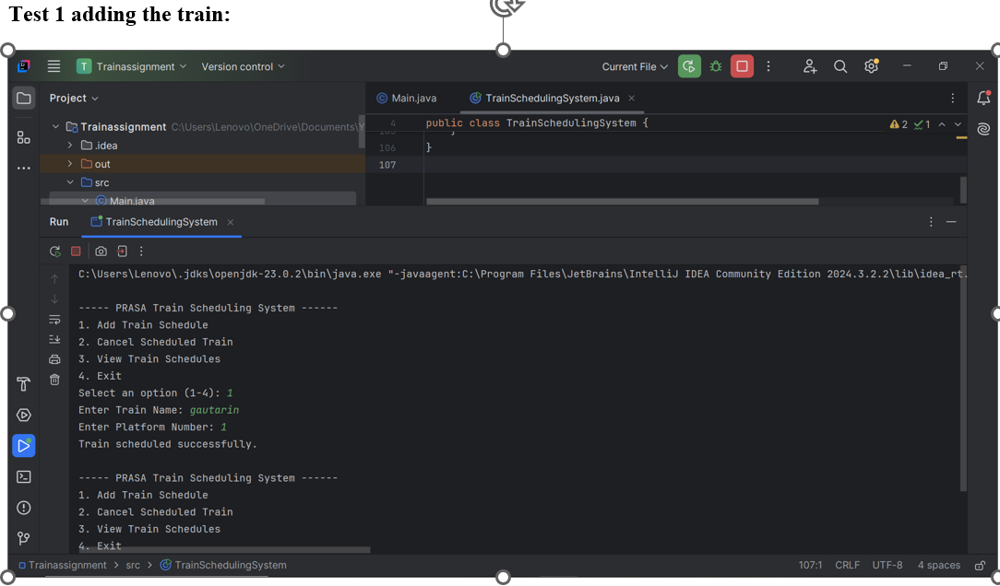
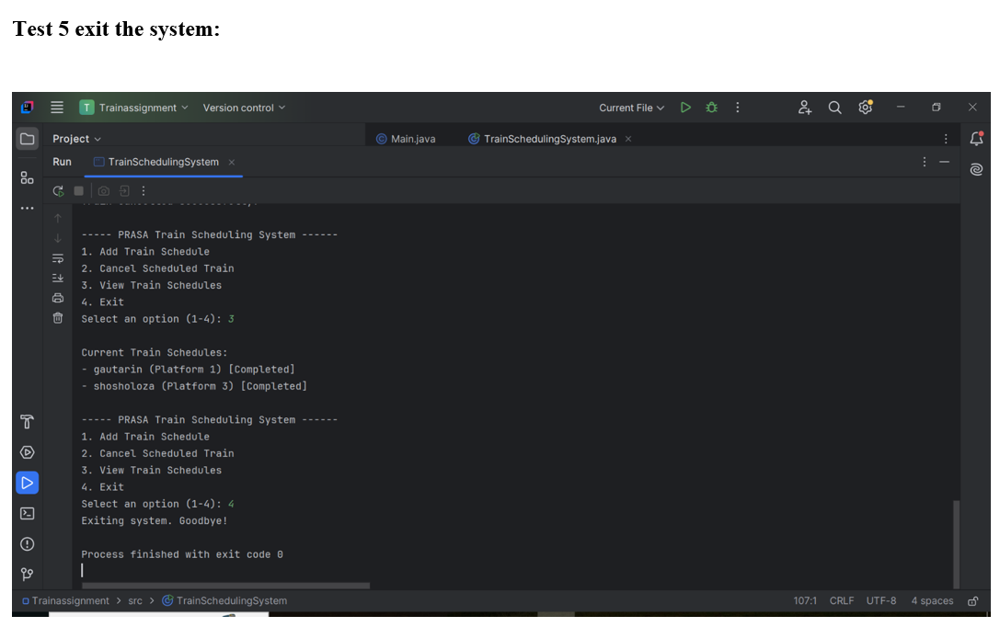

# PRASA Train Scheduling System (Asynchronous Concurrency Simulation)

A Java-based multi-threaded command-line application that simulates a real-time train scheduling and routing platform for the **Passenger Rail Agency of South Africa (PRASA)**. 

This project demonstrates core concepts of concurrent programming, thread lifecycles, and state management by simulating individual trains as independent, asynchronously running workers operating on shared station platforms.

---

## Key Features

* **Asynchronous Train Lifecycles:** Every scheduled train operates on its own dedicated thread, processing its arrival, passenger boarding, and departure cycles in the background without freezing the user interface.
* **Platform Conflict Resolution:** Includes safety checks that monitor active tracks, preventing multiple trains from being assigned to the same platform simultaneously.
* **Graceful Thread Interruption:** Demonstrates proper handling of thread interruptions, allowing station managers to cancel scheduled operations mid-transit safely.
* **Dynamic State Monitoring:** Live tracking of thread states (`isAlive()`) to visually indicate whether a train is currently running or has completed its journey.

---

## System Interface & Simulation

### Main Menu Interface
Below is the interactive control menu where station managers can dynamically add, view, or cancel scheduled trains.



### Active Thread Simulation Run
Here is the system executing multiple train lifecycles concurrently. Notice how background logs print asynchronously while the menu remains interactive.



---

## Architecture & Core Concepts Demonstrated

* **Java Concurrency API:** Leverages thread states, execution blocks, `Thread.sleep()` for time-simulation, and `Thread.interrupt()` for safe process termination.
* **Encapsulation & OOP:** Clean separation between the core operational data structure (`Train`) and the control interface (`TrainSchedulingSystem`).
* **Input Stream Management:** Employs defensive console buffer clearing to manage multi-type token parsing using `Scanner`.

---

## How to Run the Project Locally

Ensure you have the **Java Development Kit (JDK 8 or higher)** installed on your machine.

1. **Clone the repository:**
   ```bash
   git clone [https://github.com/S1ham/cloud-task-manager.git](https://github.com/S1ham/cloud-task-manager.git)

   Compile the Java files:

Bash
javac TrainSchedulingSystem.java Main.java


Run the application:

Bash
java TrainSchedulingSystem

##System Architectural Insights & Future Enhancements
While this architecture serves as a clean, effective simulation of real-time multi-threading, moving it to enterprise production environments would involve several modernization steps:

Decoupling Task from Worker (Runnable over Thread): * Current approach: The project extends the Thread class directly for architectural simplicity.

Production change: Transitioning to implementing the Runnable interface would decouple task logic from thread execution profiles, keeping the code highly maintainable and respecting Java's single inheritance model.

Thread-Safe Data Structures (Concurrency Protection): * Current approach: Standard ArrayList tracking collections are used.

Production change: Implementing Collections.synchronizedList or CopyOnWriteArrayList to prevent ConcurrentModificationException glitches if multiple background threads alter track allocations simultaneously.

Automated Resource Reclamation: * Current approach: Station platforms require manual clearing upon system cancellation.

Production change: Utilizing background callback interfaces or thread pools (ExecutorService) to automatically free up platforms and remove objects from active memory logs immediately upon natural thread completion.

Developed as a demonstration of backend software architecture and algorithmic thread management.

#Author
Siham Ali
